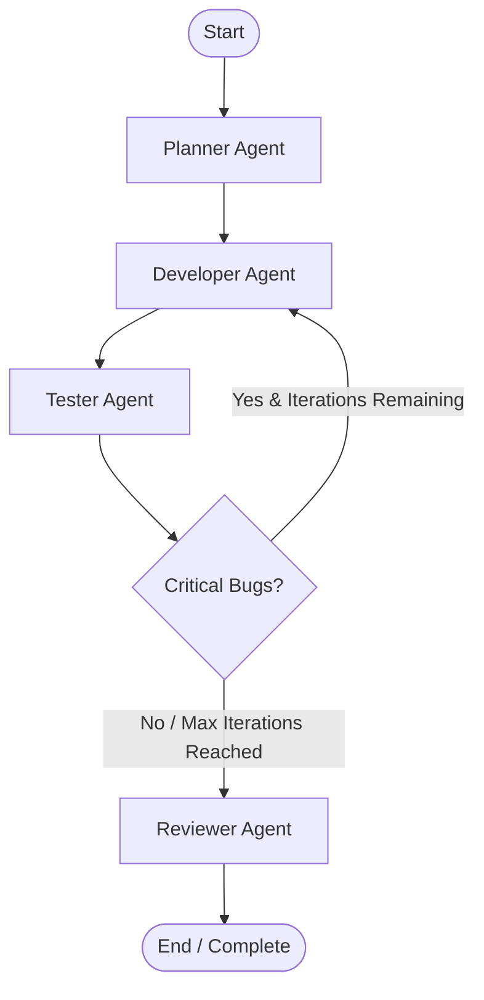

# 🤖 Project 7: AI Dev Agent

<div align="center">

[](https://www.python.org/)
[](https://fastapi.tiangolo.com/)
[](https://github.com/langchain-ai/langgraph)
[](https://www.docker.com/)
[](https://github.com/astral-sh/ruff)
[](https://mypy-lang.org/)

</div>

---

## 🚀 Overview

**AI Dev Agent** is a multi-agent orchestration pipeline that translates software ideas into fully functional, tested, and previewable web applications. Built on top of **FastAPI** and **LangGraph**, it coordinates specialized agent nodes (*Planner, Developer, Tester, Reviewer*) in a state-driven feedback loop. 

It supports multiple application runtimes (including Python, Node.js, React, Angular, and Static HTML/JS) and hosts them in isolated sandboxes with a live hot-reloading preview, proxying, and browser console feedback.

---

## 🧬 System Architecture

The core design of the AI Dev Agent separates orchestration (FastAPI & Server-Sent Events), agent decision-making (LangGraph & LangChain), and sandboxed execution (Python & Node subprocesses).

### Multi-Agent Pipeline Flow

The LangGraph state machine dictates how agents cooperate:



### End-to-End Execution Sequence

Here is how a user request flows through the FastAPI web server, the LangGraph pipeline, and the preview proxying system:

```mermaid
sequenceDiagram
    autonumber
    actor User as Developer / User
    participant API as FastAPI Server
    participant LG as LangGraph Orchestrator
    participant Sandbox as Sandbox Runner
    participant Browser as Live Preview (Proxy)

    User->>API: POST /generate (idea, runtime)
    API-->>User: Returns session_id
    Note over API,LG: Spin up background run_pipeline task
    API->>LG: Invoke Graph (Planner -> Developer -> Tester -> Reviewer)
    activate LG
    LG->>LG: Planner designs architecture & file structures
    rect rgb(30, 40, 50)
        loop Test-and-Fix Loop
            LG->>LG: Developer writes/updates files
            LG->>LG: Tester compiles code & runs unit tests
        end
    end
    LG->>LG: Reviewer evaluates overall quality
    LG-->>API: Returns final files & report
    deactivate LG
    Note over API: State marked as "done"

    User->>API: GET /stream/{session_id} (Server-Sent Events)
    API-->>User: Streams real-time agent progression events

    User->>API: POST /preview/{session_id}/start
    API->>Sandbox: Start Sandbox Runner (Python/Node process on Port 91xx)
    Sandbox-->>API: Active PID & Bind Confirmation
    API-->>User: Returns Preview URL (/preview/{session_id})

    User->>Browser: Open Live Preview Frame
    Browser->>API: HTTP Request /preview/{session_id}/index.html
    API->>Sandbox: Reverse Proxy to Port 91xx (Injects Console Capture)
    Sandbox-->>API: HTML / JS Content
    API-->>Browser: Content Served
```



---

## ✨ Key Features

- **Multi-Agent Orchestration**: Out-of-the-box state machine containing:
  - **Planner Agent**: Performs technical architecture design and identifies necessary components.
  - **Developer Agent**: Implements the codebase and fixes errors identified during testing.
  - **Tester Agent**: Executes linting, syntax analysis, and runtime tests, reporting diagnostics.
  - **Reviewer Agent**: Decides if the software meets quality requirements or requires another pass.
- **Isolated Execution Sandboxes**: Launches applications in sandbox directories using specialized subprocess managers (`python_runner`, `node_runner`, `static_runner`).
- **Live Preview & Hot Reloading**: Allocates ports dynamically (range `9100-9120`), reverse-proxies requests, and hot-reloads previews instantly upon user edits via `PUT /files/{session_id}`.
- **Console Capture Injection**: Automatically injects a script into previewed HTML applications to capture client-side JavaScript warnings and runtime errors, feeding them back to the developer agent to fix issues.
- **SSE Status Streaming**: Real-time event updates via Server-Sent Events (SSE) so users can watch the agents think, plan, code, and test in real time.
- **Multiple Runtimes Supported**:
  - `python`: Flask / FastAPI apps.
  - `node`: Express / Node.js web applications.
  - `react`: React SPAs.
  - `angular`: Angular frontend apps.
  - `static`: Pure HTML/CSS/JS frontend apps.

---

## 📁 Project Structure

```text
├── .github/             # GitHub workflow configs
├── shared/              # Shared adapters and LLM provider managers
│   ├── adapter.py       # Custom LLM API adaptors
│   └── providers.py     # LLM service initializers (OpenAI, Gemini, Claude, Bedrock)
├── src/
│   └── dev_agent/
│       ├── agents/      # LLM Agent Definitions
│       │   ├── developer.py
│       │   ├── planner.py
│       │   ├── reviewer.py
│       │   └── tester.py
│       ├── pipeline/    # LangGraph Orchestration & States
│       │   ├── executor.py
│       │   ├── graph.py
│       │   └── state.py
│       ├── sandbox/     # Isolated subprocess runtimes
│       │   ├── base.py
│       │   ├── node_runner.py
│       │   ├── preview_server.py
│       │   ├── python_runner.py
│       │   └── static_runner.py
│       ├── static/      # Frontend Single-Page Application UI
│       │   └── index.html
│       ├── main.py      # FastAPI entrypoint, routing, and reverse-proxying
│       └── schemas.py   # FastAPI request/response models
├── tests/               # Unit and integration test suites
│   ├── test_agents.py
│   ├── test_health.py
│   ├── test_pipeline.py
│   └── test_sandbox.py
├── Dockerfile           # Multi-stage production container setup
├── docker-compose.yml   # Multi-port configuration for deployment
├── pyproject.toml       # Linter (Ruff), type-checker (MyPy), and pytest settings
└── requirements.txt     # Python application dependencies
```

---

## ⚙️ Setup & Configuration

### Prerequisites
- **Python 3.12+**
- **Node.js 20+** (only required to run Node/React/Angular preview sandboxes locally)

### Installation

1. **Clone the repository:**
   ```bash
   git clone <repository_url>
   cd project-7-ai-dev-agent
   ```

2. **Create and activate a virtual environment:**
   ```bash
   python -m venv .venv
   # On Windows:
   .venv\Scripts\activate
   # On Unix/macOS:
   source .venv/bin/activate
   ```

3. **Install the dependencies:**
   ```bash
   pip install -r requirements.txt
   ```

### Configuration

Create a `.env` file in the root directory by copying the template:
```bash
cp .env.example .env
```

Open `.env` and configure your credentials:
```env
# Choose provider: google_genai:gemini-2.0-flash | openai:gpt-4o | anthropic:claude-3-5-sonnet
LLM_PROVIDER=google_genai:gemini-2.0-flash

# API Keys (set the one matching your selected provider)
GOOGLE_API_KEY=your_google_api_key_here
OPENAI_API_KEY=your_openai_api_key_here
ANTHROPIC_API_KEY=your_anthropic_api_key_here

# Observability (Optional - LangSmith tracing)
LANGSMITH_API_KEY=
LANGCHAIN_TRACING_V2=false
LANGCHAIN_PROJECT=project-7-ai-dev-agent
```

---

## 🏃 Running the Application

### Running Locally
To launch the FastAPI server locally:
```bash
uvicorn src.dev_agent.main:app --host 127.0.0.1 --port 8007 --reload
```
Once started, navigate to `http://127.0.0.1:8007` to interact with the web interface.

### Running with Docker
You can run the entire service inside an isolated Docker container:

1. **Build and run via Docker Compose:**
   ```bash
   docker-compose up --build
   ```

2. **Access the application:**
   - The web interface will be available at `http://localhost:8007`.
   - Port range `9100-9120` is forwarded to enable live previews from the container.

---

## 🔌 API Reference

### 1. Health Status
Check system configuration and available runtimes.
- **Endpoint**: `GET /health`
- **Response**:
  ```json
  {
    "status": "ok",
    "project": "project-7-ai-dev-agent",
    "provider": "google_genai:gemini-2.0-flash",
    "runtimes": ["python", "node", "react", "angular", "static"]
  }
  ```

### 2. Generate Application
Start a background agent session to design, code, and test a new app.
- **Endpoint**: `POST /generate`
- **Request Body**:
  ```json
  {
    "idea": "Build a responsive simple todo application using React",
    "runtime": "react",
    "max_iterations": 3
  }
  ```
- **Response**:
  ```json
  {
    "session_id": "a4d3b8f2-7711-47cc-ae90-c20e2ef72a2e"
  }
  ```

### 3. Event Stream
Stream live status updates and console/terminal feeds from the agent pipeline.
- **Endpoint**: `GET /stream/{session_id}`
- **Response Type**: `text/event-stream`
- **Sample Event**:
  ```text
  data: {"event": "agent_start", "agent": "developer", "iteration": 1}
  
  data: {"event": "terminal", "data": {"source": "npm test", "text": "All 5 tests passed successfully."}}
  ```

### 4. Status Check
Check session metadata.
- **Endpoint**: `GET /status/{session_id}`
- **Response**:
  ```json
  {
    "session_id": "a4d3b8f2-7711-47cc-ae90-c20e2ef72a2e",
    "status": "done",
    "current_agent": "reviewer",
    "iteration": 1,
    "max_iterations": 3,
    "runtime": "react",
    "errors": []
  }
  ```

### 5. Hot Reload Update
Update code files directly from the UI and reload the running preview.
- **Endpoint**: `PUT /files/{session_id}`
- **Request Body**:
  ```json
  {
    "files": {
      "src/App.js": "const App = () => <h1>Hello World Updated!</h1>; export default App;"
    }
  }
  ```

### 6. Start / Stop Preview
Start or terminate an isolated sandbox preview runner.
- **Endpoint**: `POST /preview/{session_id}/start` | `POST /preview/{session_id}/stop`
- **Response (Start)**:
  ```json
  {
    "port": 9100,
    "url": "/preview/a4d3b8f2-7711-47cc-ae90-c20e2ef72a2e",
    "status": "running"
  }
  ```

---

## 🛠️ Development & Testing

### Running Tests
The project contains unit and integration tests using `pytest`.

```bash
# Run unit tests (mocked LLM calls - fast)
pytest -m "unit"

# Run integration tests (requires active API keys)
pytest -m "integration"
```

### Static Analysis
Maintain code quality standards with Ruff and MyPy configurations defined in `pyproject.toml`.

```bash
# Lint check and auto-formatting
ruff check .
ruff format .

# Type checking
mypy src shared
```

---

## 📄 License
This project is licensed under the MIT License - see the LICENSE file for details.
